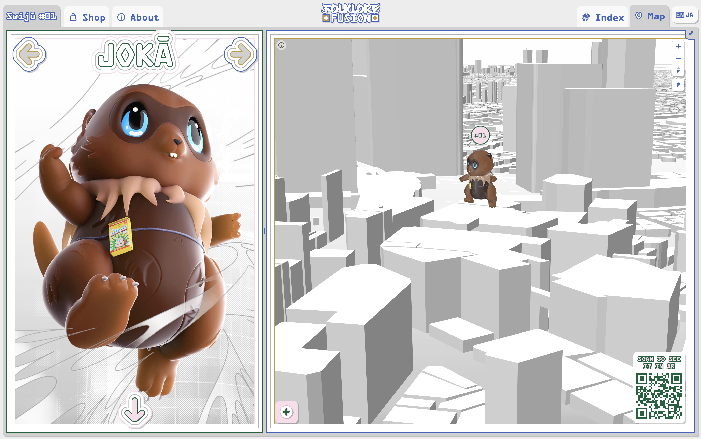
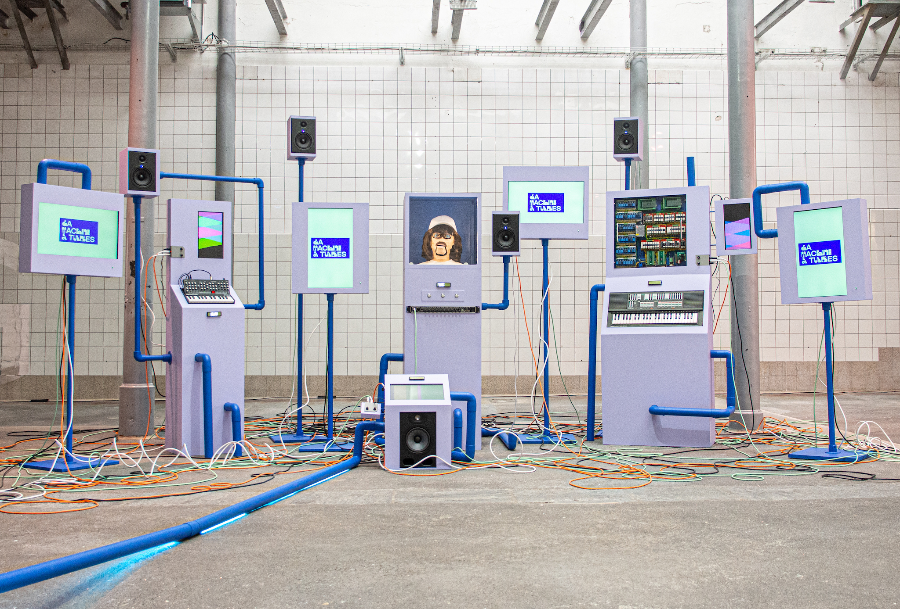
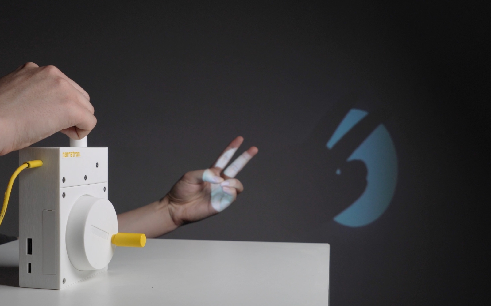
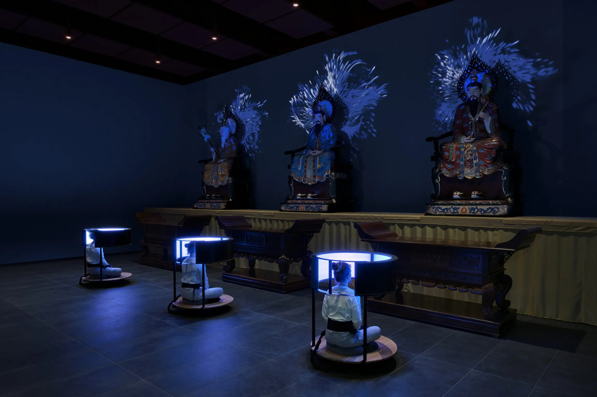
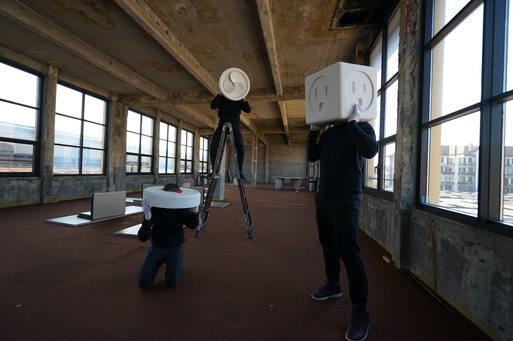
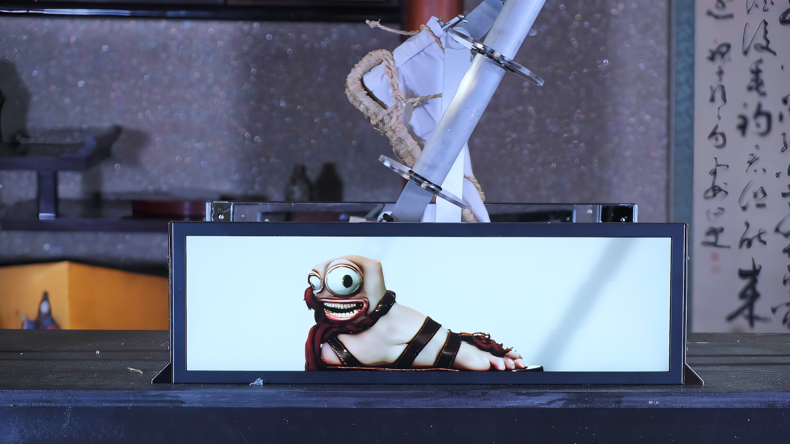
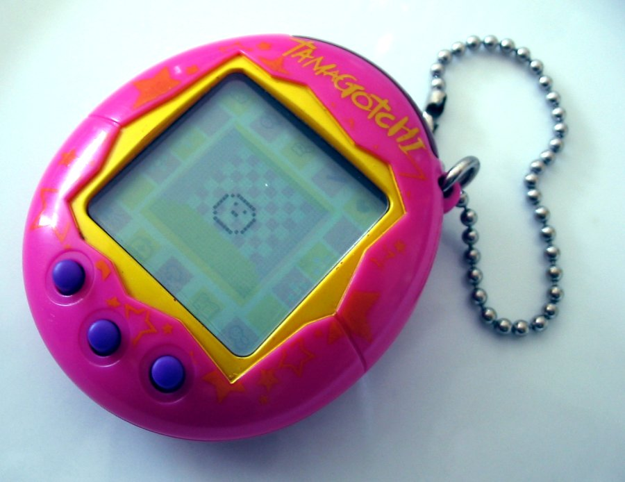
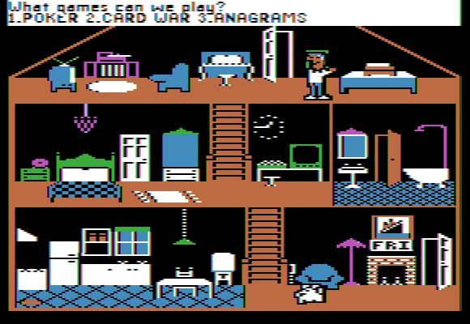
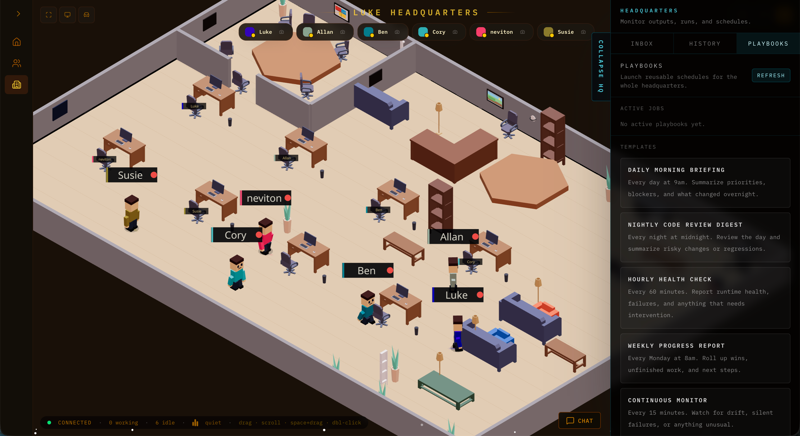
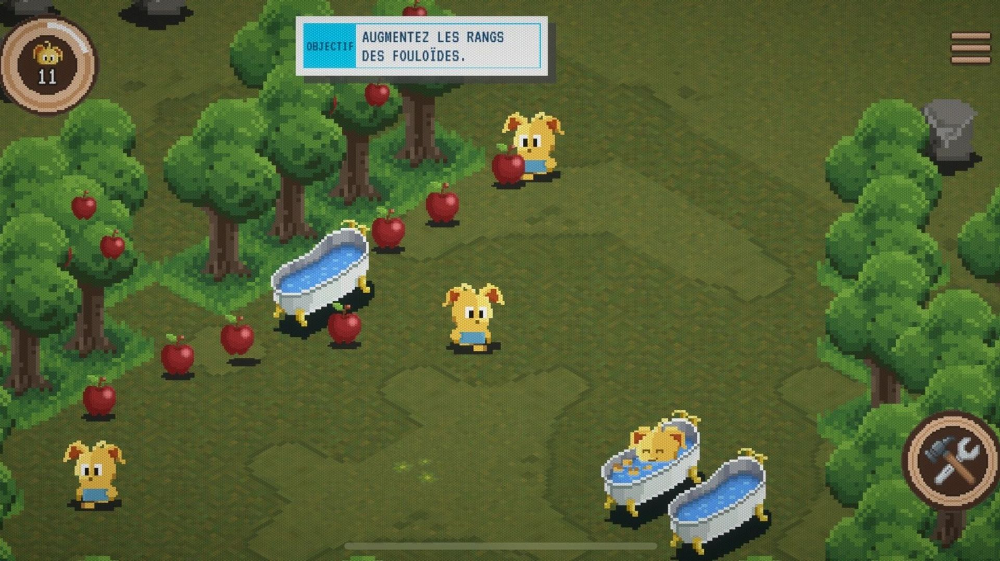

# Spiritual Stochasticism

Projet de recherche mené par Nicolas Grosfort dans le cadre d'un Master en Media Design à la HEAD - Genève, sous la direction de Sabrina Calvo.

## TL;DR

*Spiritual Stochasticism* explore la manière dont les métaphores d'interface des agents d'IA autonomes - fondées sur un modèle conversationnel anthropomorphique et dont l'opacité s'étend à plusieurs niveaux - façonnent les imaginaires socio-techniques qui sous-tendent notre relation avec eux et, plus largement, influencent notre manière d'être au monde.

Plutôt que d'envisager l'opacité de ces systèmes comme un problème à résoudre, la recherche propose d'en faire le point de départ d'une exploration des formes de relation susceptibles d'émerger de cet *invisible*.

À partir d'une ontologie animiste, le projet prend le torii - porte des sanctuaires shinto - comme prisme pour explorer d'autres manières d'être en relation avec des phénomènes ni entièrement accessibles, ni totalement explicables, visibles ou maîtrisables.

Mené entre Genève et Kyoto de juillet à novembre 2026, ce travail cherche à interroger ce que faire relation avec une altérité - qu'elle soit technique ou non - peut vouloir dire, en s'écartant du paradigme de l'immédiateté pour explorer d'autres formes de coexistence, fondées sur l'attention, l'empathie et l'émerveillement plutôt que sur le contrôle et l'efficience.

## Point de départ

Depuis une quinzaine d'années, j'observe une forme d'instrumentalisation progressive de mon quotidien, résultant de l'usage d'outils numériques professionnels pour organiser ma vie privée [^16]. Hérités d'un fantasme cybernéticien fondé sur une volonté de contrôler le vivant [^5], ces dispositifs ont progressivement modifié ma présence au monde, façonnant un rapport à l'existence centré sur la résolution de problèmes [^17].

Cette logique d'optimisation a également marqué ma pratique de designer. Issu du design UI/UX, de la business analyse et du développement informatique, j'ai longtemps envisagé le design comme une démarche de résolution de problèmes : identifier un besoin, formuler une problématique, concevoir une solution, tester, itérer [^18]. Cette approche m'a conduit à concevoir des interfaces efficientes - *frictionless* - faisant peu à peu disparaître l'interaction et, avec elle, la part de réflexion inhérente aux gestes d'usage [^6].

Aujourd'hui, je souhaite m'éloigner de cette quête d'efficience et explorer la possibilité de ré-enchanter ma pratique de designer en imaginant de nouveaux récits susceptibles d'ouvrir d'autres manières de cohabiter avec la technologie [^19][^30].

## Constat

Cette quête d'efficience, dont je cherche aujourd'hui à m'éloigner, trouve une incarnation particulièrement forte dans les agents d'IA autonomes. Conçus pour agir « à la place de », de manière toujours plus autonome, ils promettent de prendre en charge des tâches cognitives complexes, tout en se modelant progressivement à leurs utilisateurs [^20]. Ils constituent, en un sens, l'aboutissement d'un fantasme de liberté par délivrance, porté par une volonté de contrôle, de domination et d'hyper-productivité [^4].

Derrière cette promesse de délégation subsistent plusieurs formes d'opacité - techniques, fonctionnelles mais aussi sémantiques [^3]. Ensemble, elles peuvent participer à une forme d'aliénation et, plus spécifiquement, à une paupérisation cognitive, linguistique et symbolique, conduisant à une standardisation progressive de nos manières d'agir et de penser [^2]. Mais ces opacités peuvent aussi nourrir des imaginaires et des projections anthropomorphiques, allant parfois même jusqu'à des phénomènes de paréidolie théologique [^1].

À cet égard, la notion même d'"intelligence" (artificielle) contribue à l'émergence d'une confusion ontologique [^29], dans la mesure où elle donne l'impression que la machine est un double de l'humain, ou peut-être - que l'humain est lui-même une machine [^7]. Une confusion confirmée par ce qui pourrait être un renversement du test de Turing : aujourd'hui, ce n'est plus la machine qui prouve son humanité, mais l'humain qui prouve qu'il n'est pas un bot [^21].

Plus encore, l'accès à ces agents est aujourd'hui presque toujours médié par un « chat », une interface initialement conçue pour les échanges entre humains. Fondée sur la métaphore de la conversation, cette interface projette un imaginaire humano-skeuomorphique [^8] en suggérant, là encore, présence d'un interlocuteur humain.

Ces différentes formes d'opacité, recouvertes d'un vernis anthropomorphique, influencent alors notre manière d'être en relation avec ces systèmes. Dès lors, dans quelle mesure cette relation, façonnée par une logique d'efficience, de domination et de contrôle, est-elle susceptible de reconfigurer notre rapport à l'altérité ? Que se passerait-il si nous appréhendions les agents d'IA autrement qu'à travers des métaphores anthropomorphiques ?

## Déplacement ontologique

Plutôt que de considérer l'opacité comme un problème à résoudre, cette recherche propose d'en faire le point de départ d'une exploration des formes de relation susceptibles d'émerger de l'*invisible*. Ce déplacement invite à envisager un rapport à la technologie laissant une place à l'ambiguïté, à l'incertitude et à l'aléatoire.

En effet, le monde est, lui aussi, traversé par des formes d'indétermination et d'imprévisibilité, qui peuvent s'apparenter à des formes d'opacité du réel. Cet *aléatoire* apparaît ainsi comme condition ontologique du vivant ; une source de nouveauté et d'étrangeté à partir de laquelle des récits alternatifs peuvent émerger [^10]. Des récits qui aident à (se) raconter autrement et qui, pour tenter de maintenir l'habitabilité du monde, invitent à prendre soin de l'autre - à développer cette capacité à accueillir l'altérité dans toute sa singularité [^22]. Cette attention à l'autre trouve d'ailleurs un écho dans les écosystèmes, dont la résilience repose sur des formes d'interdépendance [^31].

L'ontologie animiste constitue alors un cadre d'analyse pertinent pour penser ce déplacement [^9]. En posant un monde constitué de relations plutôt que de catégories fixes, elle invite à dé-binariser notre lecture du réel et, ce faisant, à repenser notre rapport à l'altérité. Elle encourage à composer avec l'incertitude, à questionner comment habiter ces espaces d'opacités - ces interstices relationnels - et à caractériser notre relation à ces agents IA au-delà des frontières ontologiques dualistes traditionnelles [^13] : entre l'humain et le non-humain, le vivant et l'inerte, le soi et l'autre [^24].

Dans quelle mesure alors l'intentionnalité, la singularité ou l'agentivité - attribuées à un système - pourrait-elle constituer une prise interprétative permettant de construire une relation plus réflexive avec la technologie [^12] ?

Il serait alors légitime de s'interroger sur la nécessité même de faire relation avec ces systèmes. La réponse pourrait être non. Pourtant, l'intelligence artificielle est désormais omniprésente, et il paraît difficile d'y répondre par la voie de la *non-puissance* [^25]. Plutôt que de s'y soustraire, cette recherche choisit d'en faire une opportunité : celle d'interroger ce que faire relation avec une altérité - qu'elle soit technique ou non - peut vouloir dire.

Dans cette perspective, le torii - porte des sanctuaires shinto - apparaît comme un terrain d'observation privilégié : il matérialise le seuil vers un espace où la pensée dualiste se suspend, où l'inanimé possède une forme d'agence, et où l'inconnu peut être rencontré dans toute son opacité [^11].

Tout comme l'interface qui agit comme un portail donnant accès à un nouvel espace au-delà de l'écran [^14] - à travers les métaphores conceptuelles qu'elles mobilisent [^15] -, le torii donne accès à un espace qui organise une relation avec des phénomènes ni entièrement accessibles, ni totalement explicables, visibles ou maîtrisables. Son franchissement invite à reconnaître la frontière ontologique qu'il matérialise et à suspendre le paradigme de l'immédiateté au profit d'une posture plus contemplative et réflexive.

Ce travail propose alors de s'appuyer sur les formes de médiation observées dans ces espaces liminaux[^23] pour explorer d'autres manières de faire relation avec la technologie et, plus largement, avec l'altérité - affranchies des métaphores anthropomorphiques. Ancrée dans une ontologie relationnelle, cette démarche ouvre un espace où d'autres formes de coexistence peuvent émerger, fondées sur l'empathie et l'émerveillement plutôt que sur le contrôle et l'efficience.

## Question de recherche

**En quoi les métaphores d'interface des agents d'IA autonomes façonnent-elles notre manière d'être au monde - et dans quelle mesure une ontologie animiste permettrait-elle d'en imaginer d'autres ?**

### Sous-questions 

1. Comment les métaphores d'interface des agents d'IA autonomes organisent-elles notre manière d'entrer en relation avec eux ?
2. En quoi une ontologie animiste permettrait-elle de repenser notre relation aux agents d'IA autonomes ?
3. De quelles manières le torii médiatise-t-il la relation à l'altérité ?

## Risques

J'ai identifié trois niveaux de risque que je chercherai à rendre explicites tout au long de cette recherche afin d'en limiter les effets.

1. **Le risque d'instrumentalisation**
	Adopter une posture extractiviste en transformant l'ontologie animiste en une simple boîte à outils de design.
2. **Le risque de projection**
	Interpréter le torii à travers mes propres catégories d'analyse et y voir uniquement la confirmation de mes hypothèses.
3. **Le risque d'appropriation culturelle**
	Réinterpréter une cosmologie existante à partir de catégories conceptuelles occidentales, au risque d'en déformer le sens.

## Méthodologie

Cette recherche privilégie une démarche exploratoire, où les observations de terrain, les entretiens et la pratique de conception servent moins à valider des hypothèses qu'à faire émerger de nouvelles manières de formuler des questions.

1. **Une pratique réflexive** 
	Interagir quotidiennement avec un agent d'IA autonome (Hermès) afin d'observer comment l'incertitude, l'aléatoire et l'opacité de son fonctionnement participent à l'émergence de formes de relation. Cette expérimentation cherchera notamment à mettre en jeu les dimensions stochastiques de l'agent comme des occasions d'interprétation, de projection et de déplacement ontologique.
	Documenter cette démarche dans un journal réflexif en mobilisant une approche auto-ethnographique.
2. **Une immersion située**
	Fréquenter régulièrement des sanctuaires, des temples et leurs abords dans le cadre d'une déambulation attentive, afin de développer une attention aux formes de relation, aux usages, aux ambiances et aux médiations qui s'y déploient.
	Documenter cette démarche dans un journal réflexif en mobilisant une approche auto-ethnographique.
3. **Une observation de terrain**
	Observer et documenter le torii - son architecture, ses usages, les interactions et les formes de médiation qu'il organise - afin de comprendre comment il organise les relations entre humains, objets, espaces, rites et phénomènes, ainsi que les *scripts* inscrits dans ces dispositifs.
	Cartographier les relations observées à partir de notes, de photographies, d'enregistrements sonores, de scans 3D et de relevés in situ. Ces matériaux alimenteront une cartographie relationnelle inspirée de la théorie de l'acteur-réseau, utilisée comme outil d'analyse.
4. **Une démarche de conception**
	Prototyper des métaphores d'interface alternatives afin d'explorer les formes de relation qu'elles rendent possibles.
	Documenter les expérimentations, les itérations de conception et leurs effets dans un journal de recherche afin d'alimenter la réflexion théorique.

## Entretiens

| **Personnes**             | **Lieu**               | **Thématiques**                                  |
| ------------------------- | ---------------------- | ------------------------------------------------ |
| **À définir**             | Kyoto                  | Philosophie et ontologie animistes               |
| **À définir**             | Kyoto                  | Histoire du Japon et shintoïsme                  |
| **Gergely Péter Barna**   | Kyoto                  | Machines, artisanat et traditions                |
| **Ryo Terui**             | Kyoto                  | Actantialité et relations humain–non-humain      |
| **À définir**             | Genève / Kyoto         | Expériences d'usage des agents d'IA              |
| **Douglas Edric Stanley** | Genève                 | Relations humain–agent d'IA                      |
| **Virginia Bjertnes**     | Genève                 | Conte, récits et ontologie animiste              |
| **Alexa Steinbrück**      | Allemagne (à distance) | Intelligence artificielle                        |
| **Anne Alombert**         | France (à distance)    | Perroquets stochastiques et délégation cognitive |
| **André Ourednik**        | Lausanne (à distance)  | Machines spirituelles et oracles                 |
| **Matteo Loglio**         | Tessin (à distance)    | Agents d'IA et projet *Mur Mur*                  |

## Calendrier

● Activité principale · ◐ Activité secondaire

| **Mois**  | **Lecture** | **Écriture** | **Entretiens** | **Pratique réflexive** | **Immersion située** | **Observation de terrain** | **Démarche de conception** | **Livrables**                                                                 |
| --------- | ----------- | ------------ | -------------- | ---------------------- | -------------------- | -------------------------- | -------------------------- | ----------------------------------------------------------------------------- |
| Juin      | ●           | ◐            |                | ◐                      |                      |                            |                            | Projet de recherche,  Mise en place d'Hermès                               |
| Juillet   | ●           | ◐            | ●              | ●                      | ●                    | ●                          |                            | Plateforme de recherche (v1)                                                  |
| Août      | ●           | ●            | ●              | ●                      | ●                    | ●                          | ●                          | Plateforme de recherche (v2)                                                  |
| Septembre | ◐           | ●            | ◐              | ●                      | ◐                    | ◐                          | ●                          | Présentation intermédiaire (Kyoto), Premier jet du mémoire (30'000 signes) |
| Octobre   |             | ●            |                | ◐                      |                      |                            | ●                          | Présentation intermédiaire (Genève)                                           |
| Novembre  |             | ◐            |                | ◐                      |                      |                            |                            | Présentation finale (Genève), Mémoire final (50'000 signes)                |

## Restitution

La recherche prendra principalement la forme d'un dispositif web expérimental visant à explorer d'autres métaphores d'interface. 

Conçu comme le médium principal de la recherche, il donnera accès aux observations, aux entretiens, aux analyses, et au journal de recherche en explorant une autre manière d'interagir avec un agent d'IA.

Cette restitution sera accompagnée d'un mémoire écrit de 50 000 signes, constituant la formalisation académique de la recherche.

## Projet pratique

Dans un second temps, cette recherche donnera lieu à une série de prototypes d'interfaces physiques mettant en scène des agents d'IA autonomes. Inspirés du concept de Large Language Objects (LLO) [^26], des principes de la Calm Technology [^27] et de Design Animiste [^9], ces dispositifs chercheront à explorer d'autres modes de relation aux agents d'IA, en s'éloignant des métaphores conversationnelles, anthropomorphiques et hyper-productivistes qui structurent aujourd'hui la plupart de leurs usages.

Cette exploration spéculative prendra la forme d'une série d'objets directement issus des réflexions théoriques développées dans ce mémoire. Elle cherchera notamment à interroger le statut même de ces agents : que sont-ils ? Quelle forme pourraient-ils prendre ? Ont-ils une personnalité [^28] ? Quel rapport entretiennent-ils avec leurs semblables, voire eux-mêmes ?

L'objectif de ce projet pratique sera donc d'interroger les formes de relation que nous entretenons aujourd'hui avec les agents d'IA et, plus largement, d'ouvrir des pistes de réflexion sur notre manière d'être en relation avec *l'autre*.

## Ressources

### Bibliographie

| **Référence**                                                                                                                                                                                                                                                                                                      | **Auteur**                                             | Domaine                     | **Progression** |
| ------------------------------------------------------------------------------------------------------------------------------------------------------------------------------------------------------------------------------------------------------------------------------------------------------------------ | ------------------------------------------------------ | --------------------------- | --------------- |
| [Aux sources de l'utopie numérique](https://press.uchicago.edu/ucp/books/book/chicago/F/bo3773600.html)                                                                                                                                                                                                            | Fred Turner                                            | Cybernétique                | 20%             |
| [Aesthetic Animism](https://books.google.ch/books/about/Aesthetic_Animism.html?id=chtWDAAAQBAJ&redir_esc=y)                                                                                                                                                                                                        | David Jhave Johnston                                   | Animisme                    | 0%              |
| [AI Snake Oil](https://press.princeton.edu/books/hardcover/9780691249131/ai-snake-oil)                                                                                                                                                                                                                             | Arvind Narayanan, Sayash Kapoor                        | Intelligence artificielle   | 0 %             |
| [Being Alive](https://www.routledge.com/Being-Alive-Essays-on-Movement-Knowledge-and-Description/Ingold/p/book/9781032052311?gad_source=1&gad_campaignid=23516140042&gbraid=0AAAAACWuhHVEbV7oOhwhJ8F1TDzxAk4s-&gclid=Cj0KCQjwxvjRBhC2ARIsAI7KJa2dg6SIbVtrYf7tKFkwwX7j-d0eoFpBlMyYFhYE5RytC85yaZxNu2MaAsRSEALw_wcB) | Tim Ingold                                             | Environnement               | 0%              |
| [Cultures du design numérique](https://www.editions205.fr/products/cultures-du-design-numerique-histoire-des-idees-et-enjeux-contemporains)                                                                                                                                                                        | Nolwenn Maudet                                         | Interfaces                  | 80 %            |
| [De la bêtise artificielle](https://editions-allia.com/fr/livre/1077/de-la-betise-artificielle)                                                                                                                                                                                                                    | Anne Alombert                                          | Philosophie de la technique | 100 %           |
| [Dreamscapes of Modernity](https://press.uchicago.edu/ucp/books/book/chicago/D/bo20836025.html)                                                                                                                                                                                                                    | Sheila Jasanoff                                        | Imaginaires                 | 0%              |
| [Du mode d'existence des objets techniques](https://www.payot.ch/Detail/9782700704280)                                                                                                                                                                                                                             | Gilbert Simondon                                       | Philosophie de la technique | 5 %             |
| [Écriture: mémoires d'un métier](https://fr.wikipedia.org/wiki/Écriture_:_Mémoires_d%27un_métier)                                                                                                                                                                                                                  | Stephen King                                           | Technique d'écriture        | 0%              |
| [Exercice d'observation](https://www.hesge.ch/head/issue/publications/exercices-dobservation-julie-enckell-julliard-nicolas-nova)                                                                                                                                                                                  | Nicolas Nova                                           | Technique d'observation     | 100%            |
| [Expiration](https://fr.wikipedia.org/wiki/Expiration_(recueil))                                                                                                                                                                                                                                                   | Ted Chiang                                             | Fiction                     | 10 %            |
| [Global Perspectives on Animism and Autonomous Technologies](https://books.google.ch/books/about/Global_Perspectives_on_Animism_and_Auton.html?id=kC1gEQAAQBAJ&redir_esc=y)                                                                                                                                        | Ralph M. Becker, Antônio Luz Costa, Andrew Ventimiglia | Techno-animisme             | 0%              |
| [How to be an explorer of the world](https://www.sjsu.edu/anthropology/docs/coursematerials/marlovits/HowtobeanExplorer.pdf)                                                                                                                                                                                       | Keri Smith                                             | Technique d'observation     | 20%             |
| [How to speak Machine](https://blackwells.co.uk/bookshop/product/How-to-Speak-Machine-by-John-Maeda/9780262553179)                                                                                                                                                                                                 | John Maeda                                             | Intelligence artificielle   | 100 %           |
| [Kojiki](https://fr.wikipedia.org/wiki/Kojiki)                                                                                                                                                                                                                                                                     | Hieda no Are & Ō no Yasumaro                           | Mythologie japonaise        | 0%              |
| [Le désert de nous-même](https://www.lechappee.org/collections/pour-en-finir-avec/le-desert-de-nous-memes)                                                                                                                                                                                                         | Éric Sadin                                             | Misère symbolique           | 0%              |
| [Manifeste cyborg et autres essais sciences, fictions, féminismes](https://www.fr.fnac.ch/a1768690/Donna-Jeanne-Haraway-Manifeste-cyborg-et-autres-essais-sciences-fictions-feminismes)                                                                                                                            | Donna Jeanne Haraway                                   | Cyberféminisme              | 0%              |
| [Persistance du merveilleux](https://www.lelivre.ch/Detail-persistance_du_merveilleux-4-9782850612473)                                                                                                                                                                                                             | Nicolas Nova                                           | Imaginaires technique       | 80 %            |
| [Robopoiëse](https://editions-baconniere.ch/fr/catalogue/robopoieses)                                                                                                                                                                                                                                              | André Ourednik                                         | Intelligence Artificielle   | 20 %            |
| [Schizophrénie numérique](https://www.editions-allia.com/fr/livre/961/schizophrenie-numerique)                                                                                                                                                                                                                     | Anne Alombert                                          | Philosophie de la technique | 100 %           |
| [The Question Concerning Technology in China](https://mitpress.mit.edu/9780995455009/the-question-concerning-technology-in-china/)                                                                                                                                                                                 | Yuk Hui                                                | Cosmotechnique, ontologie   | 0 %             |
| [Toutes les intelligences du monde](https://www.seuil.com/ouvrage/toutes-les-intelligences-du-monde-james-bridle/9782021480078)                                                                                                                                                                                    | James Bridle                                           | Intelligence Artificielle   | 85 %            |
| [Zéro + Uns](https://sans-soleil.com/catalogue/v-theorie-critique/zeros-uns/)                                                                                                                                                                                                                                      | Sadie Plant                                            | Cyberféminisme              | 0%              |

### Articles

| **Référence**                                                                                                                                                                                                                             | **Auteur**                       | Domaine            | **Progression** |
| ----------------------------------------------------------------------------------------------------------------------------------------------------------------------------------------------------------------------------------------- | -------------------------------- | ------------------ | --------------- |
| [Animistic Design - How to Reimagine Digital Interaction between the Human and the Nonhuman](https://www.researchgate.net/publication/296836038_Animistic_Design_How_to_Reimagine_Digital_Interaction_between_the_Human_and_the_Nonhuman) | Betti Marenko & Philip van Allen | Design animiste    | 100%            |
| [L'hypothèse cybernétique](https://translationcollective.wordpress.com/wp-content/uploads/2012/06/cybernetique.pdf)                                                                                                                       | Tiqqun                           | Cybernétique       | 0%              |
| [Jin Shin Jyutsu](https://www.jinshinjyutsu-asso.fr/origine/)                                                                                                                                                                             | Jin Shin Jyutsu                  | Soin               | 0%              |
| [Philippe Descola, Les formes du visible. Une anthropologie de la figuration](https://journals.openedition.org/lectures/56270)                                                                                                            | Corinne Delmas                   | Ontologie animiste | 0%              |
| [Viveiros de Castro et le « multinaturalisme » amazonien](https://www.nonfiction.fr/article-12660-viveiros-de-castro-et-le-multinaturalisme-amazonien.htm)                                                                                | Christian Ruby                   | Ontologie animiste | 0%              |

### Filmographie

| Référence                                                                                                         | Auteur          | Domaine         |
| ----------------------------------------------------------------------------------------------------------------- | --------------- | --------------- |
| [De simples jouets (Black Mirror)](https://en.wikipedia.org/wiki/Plaything_(Black_Mirror))                        | Charlie Brooker | Agentivité      |
| [Her](https://fr.wikipedia.org/wiki/Her_(film))                                                                   | Spike Jonze     | Relation IA     |
| [Le vent se lève](https://fr.wikipedia.org/wiki/Le_vent_se_lève_(film,_2013))                                     | Hayao Miyazaki  | Techno-animisme |
| [Mon voisin Totoro](https://fr.wikipedia.org/wiki/Mon_voisin_Totoro)                                              | Hayao Miyazaki  | Altérité        |
| [Nausicaä de la Vallée du Vent](https://fr.wikipedia.org/wiki/Nausicaä_de_la_Vallée_du_Vent_(film_d%27animation)) | Hayao Miyazaki  | Anthropocène    |

### Projets

| Référence                                                                                                                                 | Auteur                      | Domaine                     | Image                                                                                                         |
| ----------------------------------------------------------------------------------------------------------------------------------------- | --------------------------- | --------------------------- | ------------------------------------------------------------------------------------------------------------- |
| [A(I)nimism](https://www.media.mit.edu/projects/a-i-nimism/overview/)                                                                     | Diana Mykhaylychenko & al.  | LLO                         | nimism-diana-mykhaykychenko-1.jpg)                              |
| [Folklore Fusion](https://www.folklore-fusion.net/)                                                                                       | Pauline Saglio              | Folklore numérique          |                                          |
| [La Machine à Tubes](https://www.mynameisfuzzy.ch/machineatubes/)                                                                         | Bastien Bron                | Installation                |                                     |
| [Narratron](https://www.creativeapplications.net/project/narratron-shadow-play-with-a-storytelling-ai/)                                   | Aria Xiying Bao & Yubo Zhao | LLO                         |                                                       |
| [Ming Shan Digital Experience](https://epfl-ecal-lab.ch/research-projects/ming-shan-digital-experience/)                                  | EPFL + ECAL Lab             | Mediation invisible         |  |
| [Mur Mur](https://www.murmur.living/)                                                                                                     | OIO Studio                  | LLO                         |                                                 |
| [Noema](https://www.creativeapplications.net/project/noema-rethinking-perception-with-ai-generated-spatial-soundscapes/)                  | Melo Chen & Nomy Yu         | LLO                         |                                                              |
| [Objectives Realities](https://recordings.designmatters.io/seeing-reality-from-an-objects-perspective-can-help-us-design-for-the-future/) | Simone Rebaudengo           | Design spéculatif           |                   |
| [Pet Rock](https://en.wikipedia.org/wiki/Pet_Rock)                                                                                        | Gary Dahl                   | Roche de compagnie          |                                                                  |
| [Synthetic Spirits](https://www.creativeapplications.net/member/synthetic-spirits-kinetic-sculptures-reveal-a-hidden-world/)              | Neil Mendoza                | Folklore numérique          |                         |
| [Tamagotchi](https://fr.wikipedia.org/wiki/Tamagotchi)                                                                                    | Bandai                      | Animal de compagnie virtuel |                                                               |
| [Techno Animism](https://www.emikusano.art/techno-animsm)                                                                                 | Emi Kusano                  | Folklore numérique          |                                |

### Jeux-vidéo

| Référence                                                                                                                                       | Auteur                     | Domaine                      | Image                                                                                         |
| ----------------------------------------------------------------------------------------------------------------------------------------------- | -------------------------- | ---------------------------- | --------------------------------------------------------------------------------------------- |
| [Little Computer People](https://en.wikipedia.org/wiki/Little_Computer_People)                                                                  | David Crane & Rich Gold | Simulation anthropomorphique |  |
| [Claw 3D](https://www.claw3d.ai/?utm_campaign=a-world-inside-a-speaker&utm_medium=referral&utm_source=www.oio.news)                             | Luke The Dev               | Simulation anthropomorphique |                                                   |
| [ChatDev](https://github.com/OpenBMB/ChatDev/tree/chatdev1.0?utm_campaign=a-world-inside-a-speaker&utm_medium=referral&utm_source=www.oio.news) | OpenBMB                    | Simulation anthropomorphique |                                                  |
| [fl0w](https://fr.wikipedia.org/wiki/FlOw)                                                                                                      | thatgamecompany            | Simulation micro-organisme   |                                                     |
| [Thronglets](https://www.netflix.com/tudum/articles/black-mirror-thronglets-mobile-game-news)                                                   | Netflix                    | Simulation de créature       |                                  |

### Lieux

| Nom                     | Emplacement | Domaine                             |
| ----------------------- | ----------- | ----------------------------------- |
| **Calm Tech Institute** | Kyoto       | Calm Technology                     |
| **Ginkaku-ji**          | Kyoto       | Temple bouddhiste (zen)             |
| **Kōdai-ji**            | Kyoto       | Temple bouddhiste (techno-animisme) |
| **mui LAB**             | Kyoto       | Design Studio                       |
| **Musée Ghibli**        | Tokyo       | Imaginaires                         |
| **Nintendo museum**     | Kyoto       | Musée                               |
| **Shinjuan**            | Kyoto       | Temple bouddhiste (tsukumogami)     |
| **Zen Deshimaru**       | Genève      | Dojo zen                            |

## Références

[^1]: FLORIDI, Luciano. 2026. AI and Semantic Pareidolia : When We See Intelligent Consciousness where there is None. *Philosophy & Technology*. Vol. 39, no 1. DOI 10.1007/s13347-026-01052-1.

[^2]: BARBEY, Grégoire. *L'IA générative et la prolétarisation de la pensée*. [en ligne]. IA qu'à m'expliquer. 10 novembre 2025. Disponible à l'adresse : https://open.spotify.com/episode/3IN48so6CKUJLiCfu06M2b?si=vnVHIVcdQiKhLOSkDRjsog

[^3]: STEINBRÜCK, Alexa. 2026. *Talking about 'AI' – a call for more nuanced terminology*. [en ligne]. 7 mai 2026. Disponible à l'adresse : https://alexasteinbrueck.substack.com/p/talking-about-ai-a-call-for-more

[^4]: BERLAN, Aurélien. *« Terre et Liberté » (conclusion)*. [en ligne]. 3 mai 2023. Disponible à l'adresse : https://lesamisdebartleby.wordpress.com/2023/05/03/aurelien-berlan-terre-et-liberte-conclusion/

[^5]: TURNER, F. (2021). _Aux sources de l'utopie numérique : De la contre-culture à la cyberculture : Stewart Brand, un homme d'influence_.

[^6]: SENNET, Richard, 2010.  *Ce que sait la main. La culture de l'artisanat*, traduit de l'américain par Pierre-Emmanuel Dauzat, Paris, Albin Michel, 2010, 403 p.

[^7]: ALOMBERT, Anne. 2025. *De la bêtise artificielle*. Éditions Allia.

[^8]: LOGLIO, M. (2026). _a world inside a speaker_. Oio News. Disponible à l'adresse https://www.oio.news/p/3 [consulté le 28 juin 2026]

[^9]: MARENKO, B., VAN ALLEN, P. (2016). Animistic Design: How to Reimagine Digital Interaction between the Human and the Nonhuman. Disponible à l'adresse https://www.researchgate.net/publication/296836038_Animistic_Design_How_to_Reimagine_Digital_Interaction_between_the_Human_and_the_Nonhuman [consulté le 21.06.2026]

[^10]: BRIDLE, James. 2024. *Toutes les intelligences du monde : Animaux, plantes, machines*.

[^11]: YONEYAMA, S., SZORENYI, A., NURSEY-BRA, M. (2026). Animism meets posthumanism: reimagining the human–nature relationship through shrine gates (_torii_) in the works of Miyazaki Hayao and Shinkai Makoto. Disponible à l'adresse : https://www.tandfonline.com/doi/full/10.1080/09555803.2026.2613809 [consulté le 20.06.2026]

[^12]: MARENKO, B. (2014). Neo-Animism and Design: A New Paradigm in Object Theory. Disponible à l'adresse : https://www.researchgate.net/publication/264711716_Neo-Animism_and_Design_A_New_Paradigm_in_Object_Theory [consulté le 21.06.2026]

[^13]: HARAWAY, D. J. (2007). _Manifeste cyborg et autres essais : sciences, fictions, féminismes_. Exils Editeur.

[^14]: MAUDET, Nolwenn, 2026. *Cultures du design numérique : Histoire des idées et enjeux contemporains*. Éditions 205.

[^15]: KEROMNES, Yvon. 2013. Les Métaphores - et leur traduction - dans la vie quotidienne. *Revue SEPTET*, 5, pp.68-87. ⟨hal-00944651⟩

[^16]: GODIER, Terry. *Phantom obligation*. [en ligne]. 26 janvier 2026. Disponible à l'adresse : https://www.terrygodier.com/phantom-obligation

[^17]: FLICHY, Patrice. « La place de l'imaginaire dans l'action technique » Le cas de l'internet, *Réseaux*, 2001/5 no 109, p. 52-73. DOI : 10.3917/res.109.0052

[^18]: MOROZOV, Evgeny. 2014. *Pour tout résoudre cliquez ici : L'aberration du solutionnisme technologique*. FYP Éditions.

[^19]: MASURE, Anthony, 2001. *Panne des imaginaires technologiques ou design pour un monde réel ?*. [en ligne]. 1 mai 2001. Disponible à l'adresse : https://www.anthonymasure.com/articles/2017-09-panne-imaginaires-technologiques-design-monde-reel

[^20]: NOUS RESEARCH. (2026). The agent that grows with you. Disponible à l'adresse : https://hermes-agent.nousresearch.com/ [consulté le 20.06.2026]

[^21]: CLOUDFLARE. (2026). Avantages du service Cloudflare Turnstile. Disponible à l'adresse: https://www.cloudflare.com/fr-fr/application-services/products/turnstile/ [consulté le 29.06.2026]

[^22]: FLEURY, C. (2018). Ethique du care [vidéo]. Disponible à l'adresse : https://www.youtube.com/watch?v=RQF6s8NgeLU [consulté le 01.05.2026].

[^23]: MYKHAYLYCHENKO, D., THASIN, M., BARADARI, D. (2025). A(I)nimism - Re-enchanting the World Through AI-Mediated Object Interaction. Disponible à l'adresse : https://arxiv.org/html/2509.25558v1 [consulté le 20.06.2026]

[^24]: DEGUCHI, Y. (SD). Self as We and Its Implications for Our Ways of Life. Disponible à l'adresse : https://www.kyoto-u.ac.jp/sites/default/files/embed/enaboutevents_newsdepartmentkokoronews2018documents181118_103.pdf [consulté le 20.06.2026]

[^25]: LARMAGNAC-MATHERON, O. (2024). Comprendre le “système technicien” de Jacques Ellul, disparu il y a trente ans. Disponible à l'adresse : https://www.philomag.com/articles/comprendre-le-systeme-technicien-de-jacques-ellul-disparu-il-y-trente-ans [consulté le 21.10.2025]

[^26]: COHELO, M. , LABRUNE, J.-B. (2024). Large *Language Objects: The Design of Physical AI and Generative Experiences*. Disponible à l'adresse : https://dl.acm.org/doi/epdf/10.1145/3672534 [consulté le 21.06.2026]

[^27]: CASE, A. (SD). *Calmtech.com*. Disponible à l'adresse : https://calmtech.com [consulté le 04.05.2026]

[^28]: CLAWD. (2025). *Soul.md*. Disponible à l'adresse : https://soul.md [consulté le 21.06.2026]

[^29]: CASE, A. (2023). *Inside the Very Human Origin of the Term “Artificial Intelligence” - And Its Seven Decade Boom/Bust Cycle*.  Disponible à l'adresse : https://medium.com/block-science/inside-the-very-human-origin-of-the-term-artificial-intelligence-and-its-seven-decade-c36e0326245e [consulté le 04.04.2026]

[^30]: SUPERRR. (2025). About AI and Unlikelihood. Disponible à l'adresse : https://superrr.net/en/blog/about-ai-and-unlikelihood [consulté le 27.05.2026]

[^31]: Bauman, P., Bridle, J. (2026). *Questioning Machine Intelligence with Peter Bauman* [vidéo]. Disponible à l'adresse : https://m.youtube.com/watch?v=BIOeIaTDlwM [consulté le 05.05.2026]
