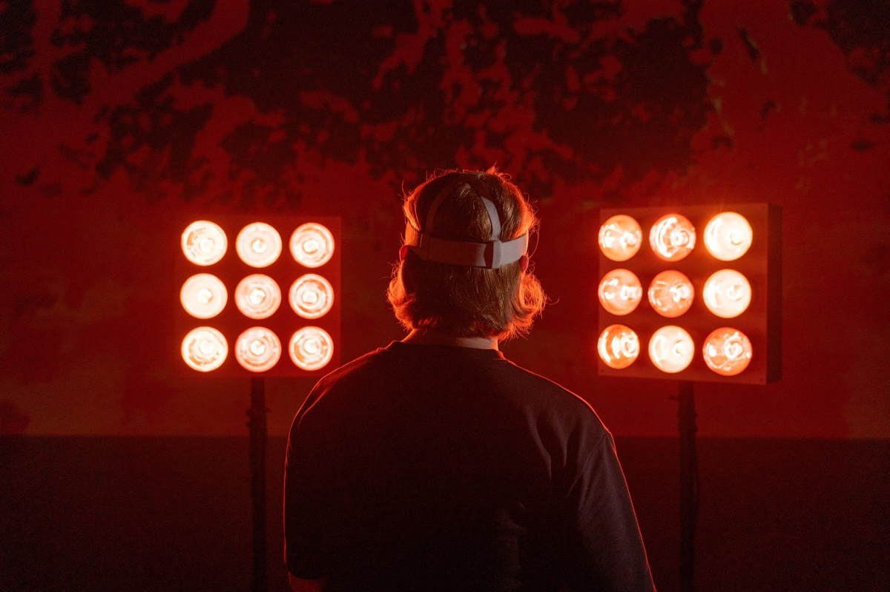

---
tags:
  - volcan
  - chaleur
  - installation
  - réalité-virtuelle
  - ecal
  - mythe
url: https://ecal.ch/fr/feed/projects/7915/vulcan/
apa: Déchanez, T. (2024). Vulcan [Projet de diplôme, École cantonale d’art de Lausanne]. ECAL. https://ecal.ch/fr/feed/projects/7915/vulcan/
---
# Vulcan

Vulcan est un voyage immersif au plus proche des puissances telluriques. Il se veut comme un hommage aux volcanologues et volcans, en abordant des thèmes tels que la petitesse humaine et la fascination pour la démesure des forces naturelles. Divisée en deux parties, la narration oppose la vision d’un volcanologue s’approchant au plus près d’un cratère à celle du dieu du feu, de la forge et des volcans, éponyme à l'expérience. Vulcan s'inspire des travaux de Haroun Tazieff, ainsi que du couple Katia et Maurice Krafft, et constitue le prolongement d'une réflexion amorcée lors de mon travail de mémoire, portant sur la reconstruction de mythes à travers les outils numériques.